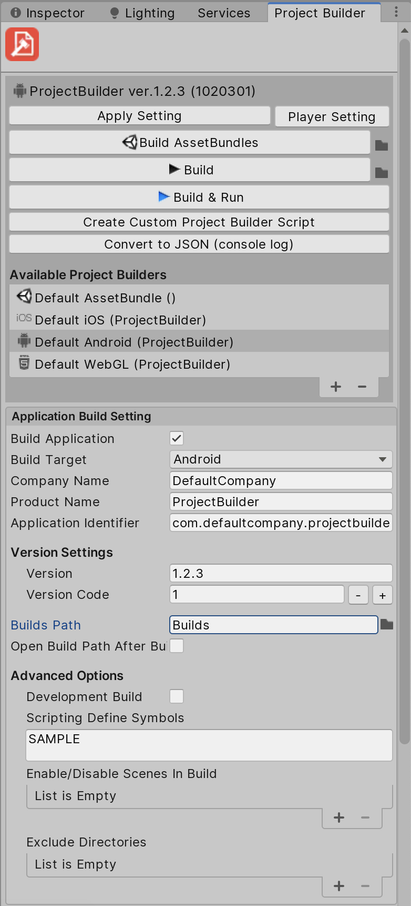
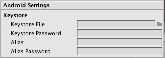
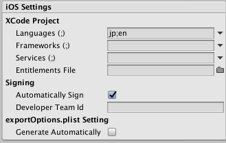
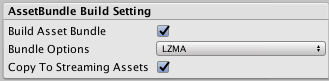

ProjectBuilder

===
### v1.0.4
===

## Overview

A tool for easy automating and customizing build process for Unity.

### Basic & Advanced Aplication Build Settings



* Build target
    * Build artifact is generated in `<project_dir>/build` directory or file.
* Company name
* Product name
* Application identifier
    * (Android) PackageName
    * (iOS) BundleIdentifier
* Development build option(Development & Script debugging)
* Defined Symbols
* Enable/Disable scenes in build
* Exclude directory in build
* Application version
* Internal version
    * (Android) BundleVersionCode
    * (iOS) BuildNumber


### Android Settings


* Keystore infomation


### iOS Settings


* XCode modifier
    * Languages
    * Frameworks
    * Services
    * Entitlement file
* Signing & Provisioning profile
* Generate exportOptions.plist


### AssetBundle Build Settings


* Compression options
* Build artifacts are generated in `<project_dir>/AssetBundles` directory
* Copy to StreamingAssets directory


## Requirement

* Unity 2019.+


## Instalation

### Using Git

Find the manifest.json file in the Packages folder of your project and add a line to `dependencies` field.

* `"dev.fd.projectbuilder": "https://github.com/ShutovPS/ProjectBuilder-Unity.git"`

To update the package, change suffix `#{version}` to the target version.

* `"dev.fd.projectbuilder": "https://github.com/ShutovPS/ProjectBuilder-Unity.git#1.0.3",`

Or, use [UpmGitExtension](https://github.com/mob-sakai/UpmGitExtension) to install and update the package.


## Usage

1. From the menu, click `Project Builder` > `Builder` (Cmnd+Shift+W) / (Ctrl+Shift+W)
2. Input build configurations.
3. Click `Buid` button to build application.
4. Build artifact is generated in build directory.


## Build on command line

* The ProjectBuilder is accessible from the command line.  
It is useful when using CI tools such as Jenkins.
* The following command option executes the build with the specified builder.  
`-batchmode -buildTarget <ios|android|webgl> -executeMethod Mobcast.Coffee.Build.ProjectBuilder.Build -builder <builder_name> [-devBuildNumber <number>] [-appendSymbols 'INCLUDE_SYMBOL;!EXCLUDE_SYMBOL;...'] [-override <builder_json>]`

* For example, The following command option executes the build for iOS with 'Develop_iOS' builder asset, with `DEBUG_MODE` symbol.  
`-batchmode -buildTarget ios -executeMethod Mobcast.Coffee.Build.ProjectBuilder.Build -builder 'Default iOS' -appendSymbols DEBUG_MODE`

Note: **DO NOT USE** `-quit` option.  
For other infomation, see this link : <https://docs.unity3d.com/Manual/CommandLineArguments.html>


#### Override builder with json

`-override <builder_json>` to override builder setting. For example as following.
* `-override "{ \"applicationIdentifier\":\"com.test.app\", \"version\":\"1.1.0\", \"defineSymbols\":\"!DEVELOPMENT_BUILD;FAKE_PURCHASE\" }"`
    * Override application identifier to "com.test.app"
    * Override version to '1.1.0'
    * Disable symbol 'DEVELOPMENT_BUILD' and enable symbol 'FAKE_PURCHASE'
* To override other parameters, convert the builder to json from `Convert to JSON (console log)` in project builder window.


## Build on Unity Cloud Build(UCB)

1. Type `Mobcast.Coffee.Build.ProjectBuilder.PreExport` at `Config > Advanced Settings > Pre-Export Method Name` on UCB.
1. Builder asset used for building will be selected automatically based on build setting label.  
For example, a build setting labeled 'Default iOS' on UCB, selects builder asset named 'Default iOS' in project.


## How to add a supported build target to build?

* Implement `IBuildTargetSettings` interface as following for build targets you need.
* Add `System.Serializable` attribute to the class to be serializable.

```cs
[System.Serializable]
public class BuildTargetSettings_WebGL : IBuildTargetSettings
{
	public BuildTarget buildTarget{get{ return BuildTarget.WebGL;}}
	public Texture icon{get{ return EditorGUIUtility.FindTexture("BuildSettings.WebGL.Small");}}
	public void Reset(){}
	public void ApplySettings(ProjectBuilder builder){}
	public void DrawSetting(SerializedObject serializedObject){}
}
```

* Add serialized field to `ProjectBuilder` or `Custom ProjectBuilder` as following.
```cs
public BuildTargetSettings_WebGL webGlSettings = new BuildTargetSettings_WebGL();
```


## Release Notes

### ver.1.0.4:

* Feature: Add android symbols.zip settings
* Fix: Fix Assembly Definitions

### ver.1.0.3:

* Feature: Update to upm
* Feature: Update android settings
* Feature: Add platform switcher
* Improvement: Code refactoring.

### ver.1.0.2:

* Feature: Add more settings for Android (Scripting Backend, Target Architecture, Build Mode)

### ver.1.0.1:

* Feature: Update build number system.
* Feature: Update output build names.
* Feature: Add custom build.
* Improvement: Code refactoring.

### ver.1.0.0:

* Feature: Override builder with json on command line.
* Feature: Memorize last selected builder each BuildTarget.
* Fixed: `Enable/Disable scenes in build` is not reflected.

### ver.0.10.1:

* Fixed: When select file path not under project directory, value to be empty.

### ver.0.10.0:

* Feature: Exclude directory in build.
* Feature: AssetBundle build report(Add/Delete/Update).

### ver.0.9.3:

* Fixed: AssetBundle output path is incorrect.

### ver.0.9.2:

* Fixed: Builder icon is not found.

### ver.0.9.1:

* Fixed: Build target on edit multiple builder.
* Changed: Rename `IPlatformSettings` to `IBuildTargetSettings`.

### ver.0.9.0:

* Feature: New editor window instead of inspector window.
* Feature: Copy AssetBundles to StreamingAssets.

### ver.0.8.1:

* Fixed: Build button for AssetBundle is not displayed.

### ver.0.8.0:

* Feature: Build AssetBundle.
    * Supports options.
    * Build artifacts are generated in `<project_dir>/AssetBundles` directory.

### ver.0.7.0:

* Fix: 'Usage For CUI' was corrected.
* Fix: Util.projectDir has error after compiling.
* Fix: (iOS) When 'Automatically Sign' is enabled, ignore 'Provisioning Profile Id', etc...

### ver.0.6.0:

* Feature: Supports WebGL.
* Feature: Supports other platforms by implementing `IPlatformSettings` interface.


### ver.0.5.0:

* Feature: Supports Unity Cloud Build.
* Feature: Enable/Disable scenes in build.


### ver.0.4.0:

* Obsolete: Obsolete 'Custom build pipeline' to simplify.
* Obsolete: Obsolete 'Generate CUI command' and explain it in Readme instead.
* Obsolete: Several CUI command options.
* Obsolete: Several BuildOptions.
* Feature: (iOS) Supports language options for XCode.


### ver.0.3.0:

* Feature: (iOS) Supports XCode 8 & Automatically Sign.
* Feature: (iOS) Add framework options.
* Feature: (iOS) Add entitlement file.
* Feature: (iOS) Apple servises (iCloud, Push, GameCenter, etc...) can be enable.
* Fix: Inspector GUI.


### ver.0.2.0:

* Supports Unity5.5+.
* Improvement: Setting items are simplified. Several items have been deleted.
* Feature: Add button to 'Build & Run'.
* Feature: (iOS) Generate 'exportOptions.plist'.
* Fix: Generated CUI command is incorrect.


### ver.0.1.0:

* Feature: Manage build configuration with builder asset.
* Feature: (Android) Keystore information.
* Feature: Custom build pipeline.
* Feature: Export `BUILD_VERSION` for CI.


## License

MIT License (see [LICENSE](LICENSE))

## See Also

* GitHub Page : https://github.com/ShutovPS/ProjectBuilder-Unity
* Issue tracker : https://github.com/ShutovPS/ProjectBuilderr-Unity/issues

* Original GitHub Page : https://github.com/mob-sakai/ProjectBuilder
* Original Issue tracker : https://github.com/mob-sakai/ProjectBuilder/issues
