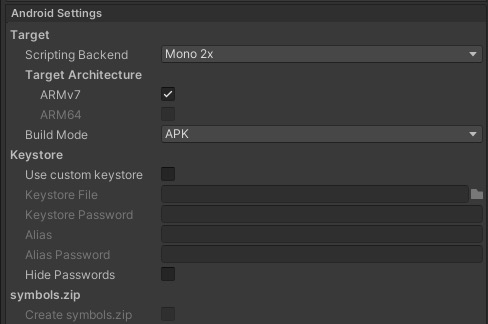

ProjectBuilder

===
### v1.1.0
===

## Overview

A tool for easy automating and customizing build process for Unity.

### Builders


* Build target
    - Build artifact is generated in `<project_dir>/build` directory or file.
  
### Basic & Advanced Aplication Build Settings

  
* Company name
* Product name
* Application identifier
    - (Android) PackageName
    - (iOS) BundleIdentifier
* Development build option(Development & Script debugging)
* Defined Symbols
* Enable/Disable scenes in build
* Exclude directory in build
* Application version
* Internal version
    - (Android) BundleVersionCode
    - (iOS) BuildNumber
  
### Android Settings


* Build architecture and mode
* Keystore infomation


### iOS Settings


* XCode modifier
    - Languages
    - Frameworks
    - Services
    - Entitlement file
* Signing & Provisioning profile
* Generate exportOptions.plist


### AssetBundle Build Settings


* Compression options
* Build artifacts are generated in `<project_dir>/AssetBundles` directory
* Copy to StreamingAssets directory


## Requirement

* Unity 2019.+


## Instalation

### Using Git

Find the manifest.json file in the Packages folder of your project and add a line to `dependencies` field.

* `"dev.fd.projectbuilder": "https://github.com/ShutovPS/ProjectBuilder-Unity.git"`

To update the package, change suffix `#{version}` to the target version.

* `"dev.fd.projectbuilder": "https://github.com/ShutovPS/ProjectBuilder-Unity.git#1.1.0",`

Or, use [UpmGitExtension](https://github.com/mob-sakai/UpmGitExtension) to install and update the package.


## Usage

1. From the menu, click `Project Builder` > `Builder` (Cmnd+Shift+W) / (Ctrl+Shift+W)
2. Input build configurations.
3. Click `Buid` button to build application.
4. Build artifact is generated in build directory.


## Build on command line

* The ProjectBuilder is accessible from the command line.
  It is useful when using CI tools such as Jenkins.
* The following command option executes the build with the specified builder.  
`-batchmode -buildTarget <ios|android|webgl> -executeMethod Mobcast.Coffee.Build.ProjectBuilder.Build -builder <builder_name> [-devBuildNumber <number>] [-appendSymbols 'INCLUDE_SYMBOL;!EXCLUDE_SYMBOL;...'] [-override <builder_json>]`

* For example, The following command option executes the build for iOS with 'Develop_iOS' builder asset, with `DEBUG_MODE` symbol.  
`-batchmode -buildTarget ios -executeMethod Mobcast.Coffee.Build.ProjectBuilder.Build -builder 'Default iOS' -appendSymbols DEBUG_MODE`

Note: **DO NOT USE** `-quit` option.  
For other infomation, see this link : <https://docs.unity3d.com/Manual/CommandLineArguments.html>


#### Override builder with json

`-override <builder_json>` to override builder setting. For example as following.
* `-override "{ \"applicationIdentifier\":\"com.test.app\", \"version\":\"1.1.0\", \"defineSymbols\":\"!DEVELOPMENT_BUILD;FAKE_PURCHASE\" }"`
    * Override application identifier to "com.test.app"
    * Override version to '1.1.0'
    * Disable symbol 'DEVELOPMENT_BUILD' and enable symbol 'FAKE_PURCHASE'
* To override other parameters, convert the builder to json from `Convert to JSON (console log)` in project builder window.


## Build on Unity Cloud Build(UCB)

1. Type `Mobcast.Coffee.Build.ProjectBuilder.PreExport` at `Config > Advanced Settings > Pre-Export Method Name` on UCB.
1. Builder asset used for building will be selected automatically based on build setting label.  
For example, a build setting labeled 'Default iOS' on UCB, selects builder asset named 'Default iOS' in project.


## How to add a supported build target to build?

* Implement `IBuildTargetSettings` interface as following for build targets you need.
* Add `System.Serializable` attribute to the class to be serializable.

```cs
[System.Serializable]
public class BuildTargetSettings_WebGL : IBuildTargetSettings
{
	public BuildTarget buildTarget{get{ return BuildTarget.WebGL;}}
	public Texture icon{get{ return EditorGUIUtility.FindTexture("BuildSettings.WebGL.Small");}}
	public void Reset(IProjectBuilder builder){}
	public void ApplySettings(IProjectBuilder builder){}
	public void DrawSetting(SerializedObject serializedObject, IProjectBuilder builder){}
}
```

* Add serialized field to `ProjectBuilder` or `Custom ProjectBuilder` as following.
```cs
public BuildTargetSettings_WebGL webGlSettings = new BuildTargetSettings_WebGL();
```


## Release Notes

CHANGELOG (see [CHANGELOG](CHANGELOG.md))

## License

MIT License (see [LICENSE](LICENSE))

## See Also

* GitHub Page : https://github.com/ShutovPS/ProjectBuilder-Unity
* Issue tracker : https://github.com/ShutovPS/ProjectBuilderr-Unity/issues

* Original GitHub Page : https://github.com/mob-sakai/ProjectBuilder
* Original Issue tracker : https://github.com/mob-sakai/ProjectBuilder/issues
